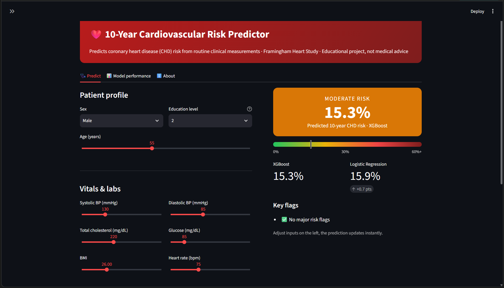
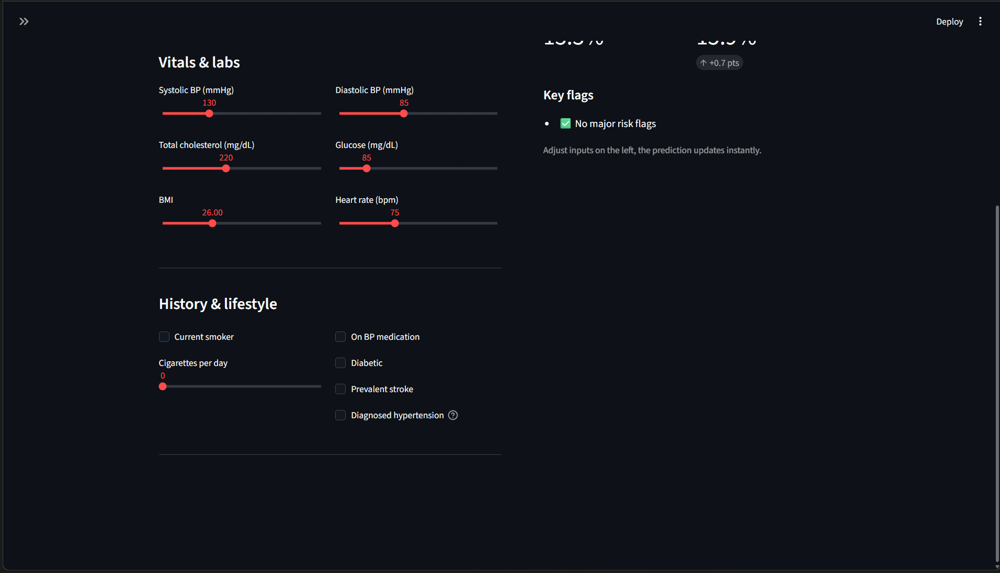
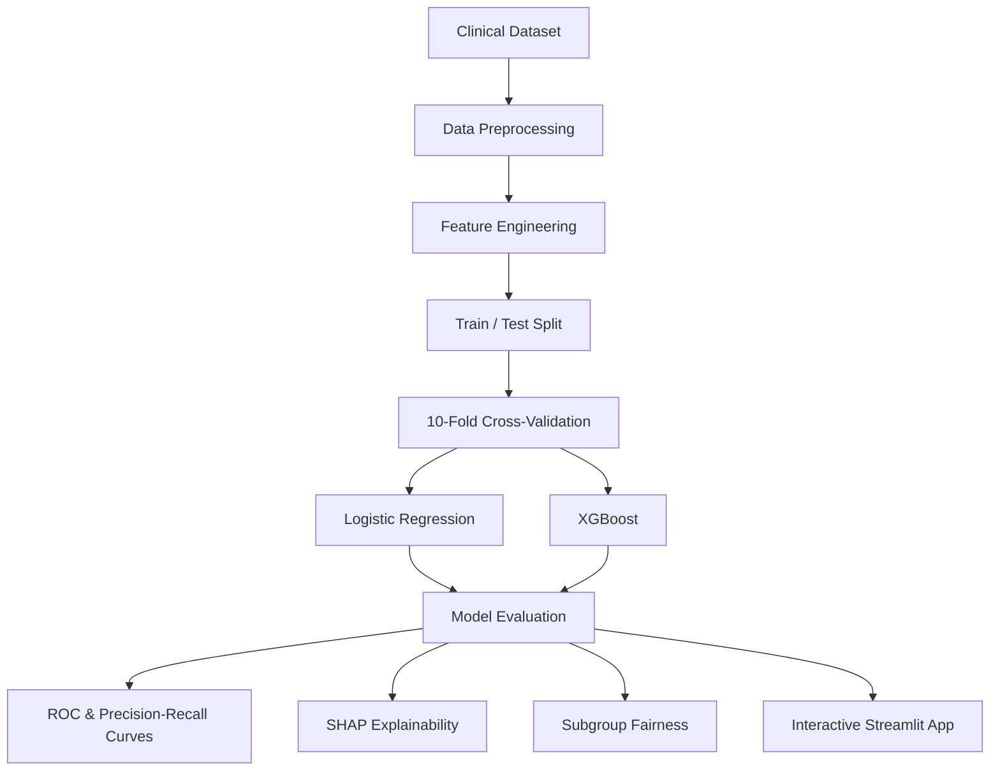
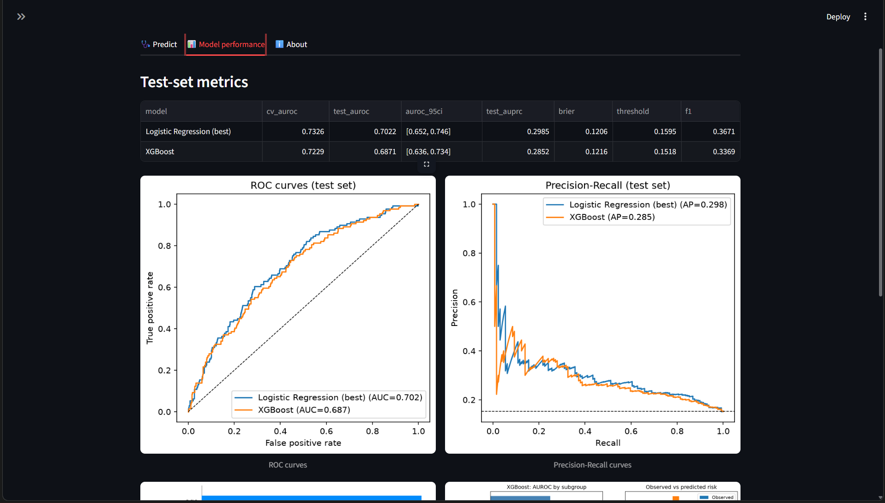
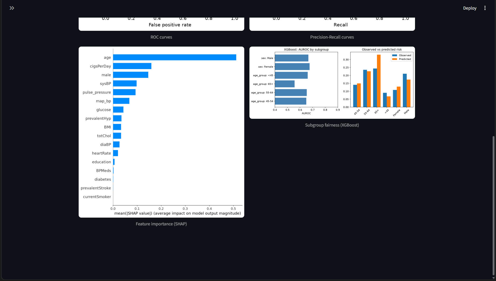

### Predicting the Future. Understanding the Risk !

**An end-to-end machine learning system for 10-year coronary heart disease (CHD) risk prediction.**

Built using the Framingham Heart Study dataset, this project compares Logistic Regression and XGBoost to explore cardiovascular risk prediction, model interpretability, and subgroup fairness.

<p align="center">
  
  
  
  
  
</p>

---

## ⚡ The Mission

What if routine clinical measurements could help identify people who may be at elevated cardiovascular risk?

CardioRisk AI explores this question through a reproducible ML pipeline combining predictive modeling, model evaluation, explainability, and fairness analysis.

- 🫀 **Risk prediction** — estimate 10-year CHD risk from clinical features.
- 🧠 **Model comparison** — evaluate regularized Logistic Regression against XGBoost.
- 🔬 **Explainable AI** — investigate feature contributions using SHAP.
- ⚖️ **Fairness analysis** — examine performance across patient subgroups.
- 🚀 **Interactive experience** — explore predictions using a Streamlit interface.

> ⚠️ **Educational project only.** Predictions are experimental model outputs, not medical diagnoses or clinical recommendations.

## 🎬 See It in Action

The interactive dashboard lets users adjust patient characteristics and compare predicted risk estimates from both models.

<p align="center">
  
</p>
<p align="center"><em>Prediction dashboard — patient profile, risk estimate, model comparison, and key flags.</em></p>

<details>
  <summary><strong>View more dashboard inputs</strong></summary>
  <p align="center">
    
  </p>
</details>

### Dashboard features

- Patient profile and clinical input controls
- XGBoost-based risk estimate
- Logistic Regression comparison
- Key risk flags
- Model performance and project information tabs

## 🧬 Under the Hood

| Component | Implementation |
|---|---|
| Dataset | Framingham Heart Study |
| Dataset size | 4,240 patients |
| Clinical features | 15 |
| Prediction target | 10-year CHD outcome |
| Baseline model | Regularized Logistic Regression |
| Comparison model | XGBoost |
| Validation approach | 80/20 train-test split and 10-fold cross-validation |
| Primary evaluation metric | AUROC |
| Interpretability | SHAP |
| Fairness | Subgroup evaluation |
| Interface | Streamlit |

## 🏗️ ML Pipeline



## 📊 Model Performance

The current test-set results shown by the app are:

| Metric | Logistic Regression (best) | XGBoost |
|---|---:|---:|
| Cross-validation AUROC | 0.7326 | 0.7229 |
| Test AUROC | 0.7022 | 0.6871 |
| Test AUROC 95% CI | 0.652–0.746 | 0.636–0.734 |
| Test average precision (AUPRC) | 0.2985 | 0.2852 |
| Brier score | 0.1206 | 0.1216 |
| Classification threshold | 0.1595 | 0.1518 |
| F1-score | 0.3671 | 0.3369 |

**Interpretation:** On this test split, Logistic Regression has a slightly higher AUROC and average precision than XGBoost. These results are specific to this dataset split and should not be interpreted as evidence of clinical readiness.

<p align="center">
  
</p>
<p align="center"><em>Model performance — test-set metrics, ROC curves, and precision-recall curves.</em></p>

## 🔍 Explainability & Fairness

The project includes feature-importance analysis using SHAP and subgroup analysis by sex and age group. These visualizations help inspect which features influence model output and how model behavior varies across evaluated groups.

<p align="center">
  
</p>
<p align="center"><em>Model analysis — SHAP feature importance and subgroup fairness results.</em></p>

## 📁 Project Architecture

```text
cardio-risk-prediction_ML/
├── app/
│   └── demo.py
├── data/
│   ├── raw/
│   └── processed/
├── models/
├── notebooks/
├── results/
│   ├── figures/
│   ├── fairness_*.csv
│   └── metrics.csv
├── src/
├── requirements.txt
├── run_all.py
└── README.md
```

## 🚀 Run the Project

Run the full pipeline:

```bash
python run_all.py
```

Launch the interactive Streamlit app:

```bash
streamlit run app/demo.py
```

Other useful commands:

```bash
python -m src.predict
jupyter notebook notebooks/
```

## 🧪 Reproducibility & Responsible ML

- **Leakage prevention:** preprocessing and scaling are handled inside scikit-learn pipelines fitted on training folds.
- **Threshold selection:** the classification threshold is selected using out-of-fold training predictions rather than the held-out test set.
- **Multiple evaluation views:** compare model discrimination, classification metrics, explainability, and subgroup results.
- **Responsible interpretation:** subgroup differences should be investigated rather than automatically interpreted as proof of bias or fairness.
- **Clinical limitations:** dataset limitations, calibration, external validation, and clinical applicability require careful consideration.

## 🗺️ Roadmap

- [x] Train and compare Logistic Regression and XGBoost
- [x] Build an interactive prediction dashboard
- [x] Generate evaluation and explainability outputs
- [x] Perform subgroup fairness analysis
- [x] Document observed evaluation metrics
- [ ] Explore calibration and external validation

## 👥 Team

| Team member | Project contribution |
|---|---|
| Pavithra Reddy — PES1UG24CS489 | Machine learning / project |
| Vibhav M — PES1UG24CS527 | Machine learning / project |

## 📚 References

- Framingham Heart Study dataset.
- Nguyen, CS229 (2019) — reference methodology used in the project.
'''